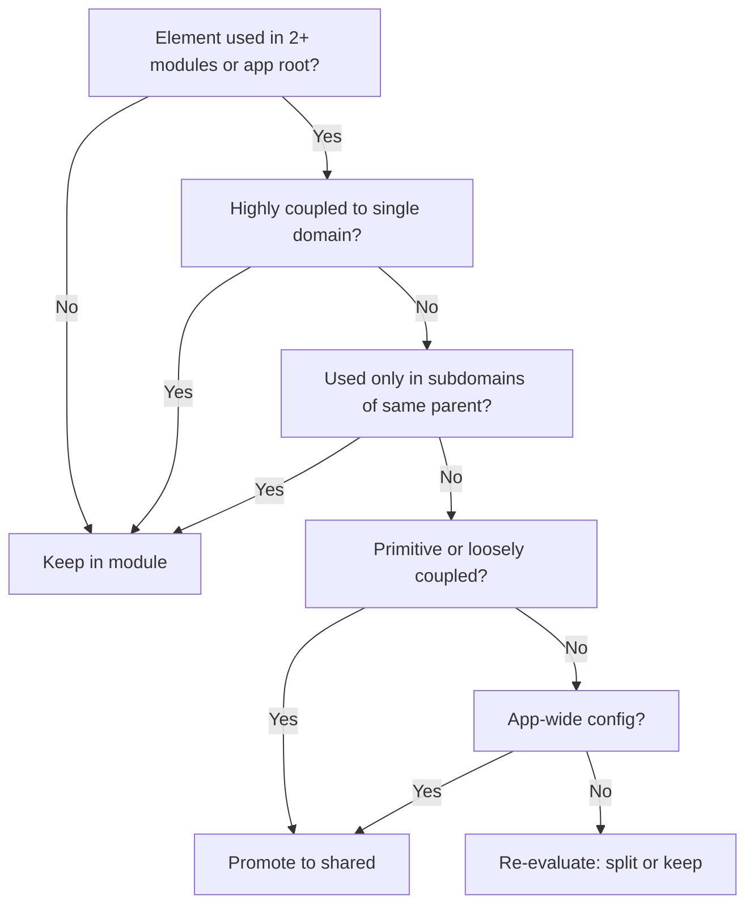

# Architecture

**Version 0.1.0 (draft)**

All components, logic, and related code live under domain-specific modules in the `modules/` directory. This keeps separation of concerns and maintainability.

## Module-based layout

- **Shared**: `modules/shared/` — Used by multiple modules or by the app root (layout, pages).
- **Domain**: `modules/{module-name}/` — Everything specific to one business domain.

Nothing lives in a generic `app/components/`, `components/`, or `src/components/` at the repo root; it all goes under `modules/`.

## Shared module

**Location**: `modules/shared/`

**Typical structure**:

```
modules/shared/
  ├── components/   # Shared UI (app-sidebar, site-header, ui primitives)
  ├── hooks/        # Shared React hooks
  ├── lib/          # Shared utilities (feature-flags, fetcher, utils)
  ├── providers/    # Shared context providers
  ├── types/        # Types at module root only. See [conventions.md § Types placement](conventions.md#types-placement)
  └── config/       # Shared config (e.g. navbar)
```

**When to use**: Put code in `shared` when it is used in more than one domain module or in the app root (layout, global pages). Generic UI (buttons, dialogs, navigation) and cross-cutting concerns (feature flags, fetcher) belong here.

## Domain modules

**Location**: `modules/{module-name}/`

**Typical structure**:

```
modules/{module-name}/
  ├── components/   # Module-specific components
  ├── lib/          # Module-specific utilities
  ├── hooks/        # Module-specific hooks
  ├── providers/    # Module-specific context (if needed)
  ├── types/        # Types at module root only. See [conventions.md § Types placement](conventions.md#types-placement)
  ├── services/     # Domain services (optional)
  ├── graphql/      # GraphQL operations (optional)
  └── mocks/        # Mocks for this domain (optional)
```

**When to use**: Put code in a domain module when it is only used within that domain or is tightly coupled to that domain’s business logic.

**Examples**: `modules/builders/`, `modules/finances/`, `modules/workstream/`, `modules/networks/`, `modules/expense-reports/`.

## Promotion rules

**Quick rule:** Promote only when used in 2+ modules or app root, not domain-coupled, not subdomain-scoped, and (primitive, loosely coupled, or app-wide config).

**Promotion** is the action of moving an existing element (component, hook, lib util, service, mock, provider, type, config) from a domain module to `modules/shared/`. An **element** is any unit of code in a module layer.

### Keep in module (do not promote)

| Rule | Description |
|------|-------------|
| **Single-module use** | Element is used only within that module. |
| **Domain-coupled** | Element is used in several modules but is highly coupled to the module's purpose. Example: `useServicePurchaseModal` used across builders, finances, workstream—but it's specific to the service-purchase flow; keep in `modules/service-purchase/`. |
| **Subdomain scope** | Element is used only in modules that are subdomains of the same parent domain. Example: `services`, `service-purchase`, `operator-profile` are subdomains of the Services domain; shared code among them stays in the most appropriate subdomain, not in `shared`. |

### Promote to shared

| Rule | Description |
|------|-------------|
| **Primitives** | Element is a primitive (generic UI, pure util, low-level hook) used in several modules across different domains. |
| **Cross-domain, loosely coupled** | Element is used in several modules and is NOT tightly coupled to any single domain's business logic. |
| **App-wide config** | Element is configuration that affects the whole app or several unrelated modules (e.g. feature flags, navbar config). |

### Do not promote (anti-patterns)

| Rule | Description |
|------|-------------|
| **Speculative promotion** | Do not promote based on the presumption that an element "could" be used elsewhere. Promote only when that future is present—i.e. when it is actually used in multiple modules or app root. |

### Principles (SOLID, KISS, DRY)

| Principle | Promotion-related rule |
|-----------|------------------------|
| **Single Responsibility (SRP)** | If promoting would force a component/hook to serve multiple unrelated concerns, consider splitting first: promote only the generic part; keep domain-specific logic in the module. |
| **Open/Closed (OCP)** | Shared elements should be extensible via props/composition rather than requiring modification for each consumer. If an element needs heavy customization per module, it may not be a good candidate for promotion. |
| **Dependency Inversion (DIP)** | Domain modules should depend on shared abstractions (types, interfaces), not on other domain modules. Promoting shared types/interfaces to `modules/shared/types/` supports this. |
| **KISS** | Prefer keeping elements in the module if promotion adds unnecessary indirection or complexity. Don't over-abstract. |
| **DRY** | Promote when the same logic/UI is duplicated across modules and the duplication is real (not speculative). Extract to shared only after duplication exists. |

### Promotion decision flow



### Example scenarios

| Scenario | Decision | Reason |
|----------|----------|--------|
| `Button` used in builders, finances, expense-reports | Promote | Primitive, loosely coupled |
| `useServicePurchaseModal` used in builders, finances, workstream | Keep in service-purchase | Highly coupled to service-purchase domain |
| Shared util between `services` and `service-purchase` only | Keep in services (or service-purchase) | Subdomain scope; both are Services subdomains |
| Feature flags config | Promote | App-wide config |
| `formatCurrency` used only in expense-reports | Keep | Single-module use |
| Hypothetical "could be useful in roadmap" util | Keep | Speculative; promote when actually used |

## Component placement decision tree

Use the [Promotion rules](#promotion-rules) above when moving existing elements. For new elements:

1. **Is it used in multiple modules or in the app root?**
   - Yes → Check promotion rules: if not domain-coupled, not subdomain-scoped, and (primitive, loosely coupled, or app-wide config) → `modules/shared/` (components, hooks, lib as appropriate).
   - No → go to step 2.

2. **Is it specific to a single domain?**
   - Yes → `modules/{domain-name}/` (components, hooks, lib as appropriate).
   - No → Re-evaluate (e.g. split into shared + domain pieces).

## Import patterns

**From shared**:

```typescript
import { Button } from '@/shared/components/ui/button'
import { useMobile } from '@/shared/hooks/use-mobile'
import ff from '@/shared/lib/feature-flags'
```

**From a domain module**:

```typescript
import { TransactionList } from '@/modules/transaction/components/transaction-list'
import { useTransactionForm } from '@/modules/transaction/hooks/use-transaction-form'
```

Use `@/shared/` for shared module imports and `@/modules/` for domain modules; do not use relative paths that escape the module (e.g. `../../../shared/`).

## Best practices

1. **Keep modules focused** — One domain or feature area per module.
2. **Minimize cross-module dependencies** — Prefer depending on `shared` rather than domain A depending on domain B.
3. **Shared code goes to shared** — If two or more modules (or app root) use it **and** it is not domain-coupled or subdomain-scoped, it belongs in `shared`. See [Promotion rules](#promotion-rules).
4. **Co-locate** — Keep a feature’s components, hooks, and utilities in the same module.
5. **Use index files** — Export module components through `index.ts` for cleaner imports.
6. **Component files are component-only** — Put shared logic and helpers in the module’s `lib/` (or utils); keep component files to a single component and minimal JSX-related logic. See [conventions.md](conventions.md).
7. **Reusable types at module root only** — See [conventions.md § Types placement](conventions.md#types-placement).
8. **Follow promotion rules** — When moving elements to shared, apply the [Promotion rules](#promotion-rules). Do not promote speculatively; promote only when an element is actually used in multiple modules or app root.

## Correct vs incorrect structure

**Correct**:

```
modules/
  ├── shared/
  │   ├── components/
  │   │   ├── app-sidebar/
  │   │   │   ├── app-sidebar.tsx
  │   │   │   └── index.ts
  │   │   └── ui/
  │   └── hooks/
  │       └── use-mobile.ts
  └── transaction/
      ├── components/
      │   ├── transaction-list/
      │   │   ├── transaction-list.tsx
      │   │   └── index.ts
      │   └── transaction-form/
      │       ├── transaction-form.tsx
      │       └── index.ts
      ├── hooks/
      │   └── use-transaction-form.ts
      └── lib/
          └── transaction-service.ts
```

**Incorrect**:

```
app/components/transaction-list.tsx   # Should be in modules/transaction/
components/shared/button.tsx           # Should be in modules/shared/
src/components/transaction.tsx        # Should be in modules/transaction/
```
